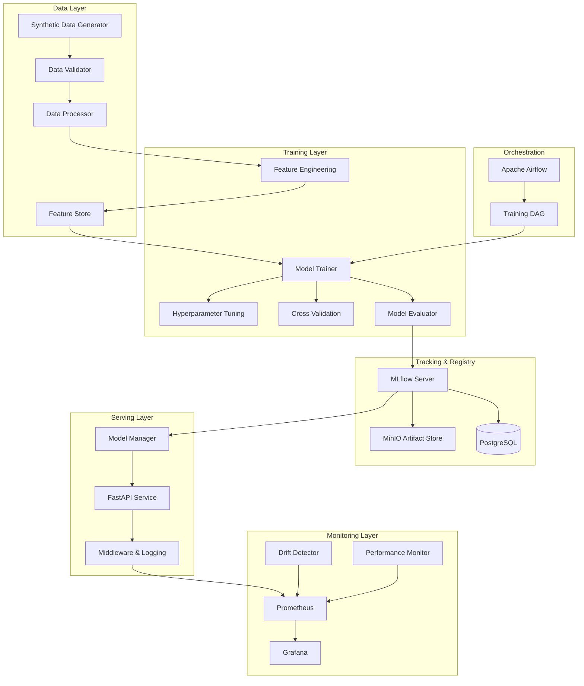
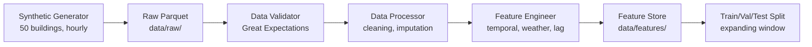
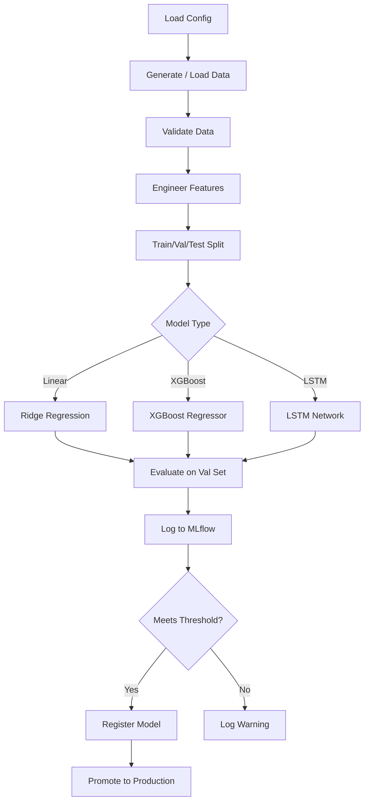
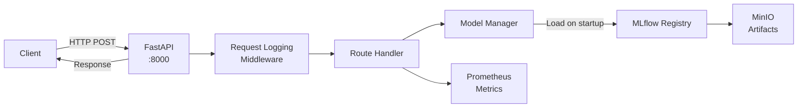
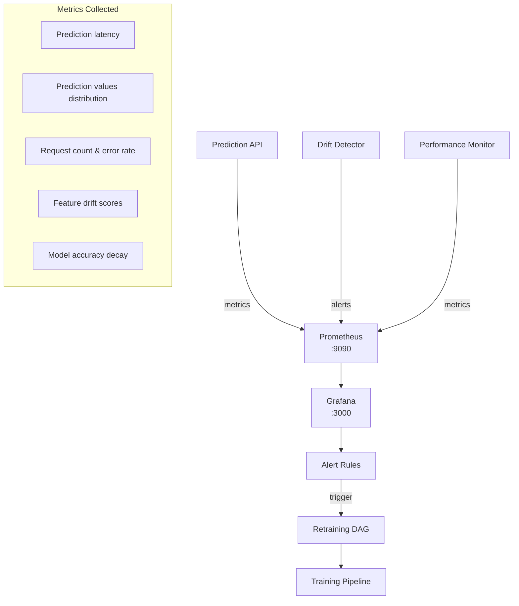

# Architecture

This document describes the end-to-end architecture of the Energy Demand Forecasting MLOps System, including data flows, component interactions, and technology choices.

---

## System Overview

The system is a production-grade MLOps platform for building-level energy demand forecasting. It covers the full machine learning lifecycle: data generation, validation, feature engineering, model training, experiment tracking, serving, monitoring, and orchestration.

---

## Data Flow

The data pipeline transforms raw energy consumption records into model-ready feature matrices.

### Data Generation

The `SyntheticDataGenerator` produces realistic hourly energy consumption data with:

- **Daily seasonality** -- peak usage during business hours, low usage overnight
- **Weekly seasonality** -- reduced consumption on weekends
- **Yearly seasonality** -- heating/cooling driven by temperature cycles
- **Weather correlation** -- temperature and humidity effects on HVAC load
- **Holiday effects** -- reduced consumption on public holidays
- **Building-specific profiles** -- each building has unique base load and sensitivity parameters
- **Configurable noise** -- Gaussian noise with adjustable standard deviation

### Validation

Data validation uses Great Expectations to enforce schema constraints:

- No null values in critical columns (`timestamp`, `building_id`, `energy_kwh`)
- Temperature within physical bounds (-50 to 60 degrees C)
- Humidity between 0 and 100 percent
- Energy consumption non-negative
- Timestamp monotonicity per building

### Feature Engineering

The `FeatureEngineer` creates the following feature groups:

| Feature Group | Examples | Rationale |
|---|---|---|
| Temporal | `hour_sin`, `hour_cos`, `day_of_week`, `month`, `is_weekend` | Captures cyclical consumption patterns |
| Weather | `temperature`, `humidity`, `temp_rolling_mean_24h` | HVAC load depends on outdoor conditions |
| Lag | `energy_lag_1h`, `energy_lag_24h`, `energy_lag_168h` | Autoregressive signal from recent history |
| Rolling | `energy_rolling_mean_24h`, `energy_rolling_std_24h` | Smoothed trend and volatility |
| Interaction | `temp_x_hour`, `humidity_x_is_weekend` | Non-linear cross-feature effects |

---

## Training Pipeline

### Model Types

**Linear Baseline (Ridge Regression)**
- Serves as the performance baseline
- Fast training, interpretable coefficients
- Configuration: `alpha=1.0`, `fit_intercept=true`

**XGBoost (Primary)**
- Gradient-boosted decision trees -- strong tabular performance
- Handles non-linear interactions and missing values natively
- Configuration: 500 estimators, max depth 6, learning rate 0.05
- Early stopping with 50-round patience

**LSTM (Deep Learning)**
- Sequence model capturing long-range temporal dependencies
- Input: 168-hour (1 week) sliding windows
- Architecture: 2 layers, 128 hidden units, 0.2 dropout
- Training: Adam optimizer, learning rate 0.001, patience 10

### Hyperparameter Tuning

Optuna-based Bayesian optimization:
- 50 trials per search (configurable)
- 1-hour timeout
- Optimizes RMSE via expanding-window cross-validation
- 5-fold time-series splits with 24-hour gap between train and test

### Evaluation Metrics

| Metric | Description |
|---|---|
| RMSE | Root Mean Squared Error -- primary optimization target |
| MAE | Mean Absolute Error -- interpretable error magnitude |
| MAPE | Mean Absolute Percentage Error -- scale-invariant |
| R-squared | Proportion of variance explained |

---

## Serving Architecture

### API Endpoints

| Method | Path | Description |
|---|---|---|
| `POST` | `/predict` | Single building prediction |
| `POST` | `/predict/batch` | Batch predictions (multiple buildings) |
| `GET` | `/health` | Service health and model status |
| `GET` | `/model/info` | Active model metadata |

### Model Manager

The `ModelManager` singleton:
1. Loads the Production-stage model from MLflow at application startup
2. Caches the model in memory for low-latency inference
3. Exposes model metadata (version, metrics, feature list)
4. Returns a `503 Service Unavailable` if no model is loaded

### Request Processing

1. Parse and validate the JSON request body (Pydantic v2)
2. Extract temporal features from the timestamp (hour sin/cos encoding)
3. Build the feature vector in deterministic column order
4. Run inference through the loaded model
5. Compute confidence interval (plus/minus 10 percent, minimum 5 kWh)
6. Record latency and prediction value in Prometheus
7. Return the structured JSON response

---

## Monitoring and Feedback Loop

### Drift Detection

The `DriftDetector` uses Evidently to monitor:

- **Data drift** -- statistical shift in input feature distributions (KS test, PSI)
- **Target drift** -- shift in predicted energy values
- **Concept drift** -- degradation in model accuracy over time

When drift exceeds configured thresholds, alerts fire via Prometheus alerting rules, which can trigger an automated retraining cycle through Airflow.

### Prometheus Metrics

- `prediction_latency_seconds` (Histogram) -- inference time per request
- `prediction_value_kwh` (Histogram) -- distribution of predicted values
- `prediction_requests_total` (Counter) -- total requests by status and model version
- `model_load_time_seconds` (Gauge) -- time taken to load the model
- `drift_score` (Gauge) -- current drift score per feature

### Grafana Dashboards

Pre-provisioned dashboards:
- **API Performance** -- latency percentiles, throughput, error rates
- **Model Health** -- prediction distribution, drift scores, accuracy metrics
- **Infrastructure** -- service health, resource usage

---

## Orchestration

Apache Airflow manages scheduled pipeline execution.

### Training DAG

The `training_dag` runs weekly and executes:

1. **generate_data** -- produce fresh synthetic data (or ingest real data)
2. **validate_data** -- run Great Expectations validation suite
3. **engineer_features** -- transform raw data into model features
4. **train_model** -- train the configured model type
5. **evaluate_model** -- compute metrics on the holdout set
6. **register_model** -- push to MLflow Model Registry if metrics pass threshold

Configuration:
- Owner: `ml-engineering`
- Retries: 2 (10-minute delay)
- Execution timeout: 2 hours
- Executor: LocalExecutor backed by PostgreSQL

---

## Infrastructure

### Docker Compose Services

| Service | Image | Port | Purpose |
|---|---|---|---|
| `postgres` | `postgres:15` | 5432 | Backend store for MLflow and Airflow |
| `minio` | `minio/minio:latest` | 9000, 9001 | S3-compatible artifact storage |
| `mlflow` | `ghcr.io/mlflow/mlflow:v2.9.2` | 5000 | Experiment tracking and model registry |
| `api` | Custom Dockerfile | 8000 | FastAPI prediction service |
| `airflow-webserver` | Custom Dockerfile | 8080 | Airflow web UI |
| `airflow-scheduler` | Custom Dockerfile | -- | DAG scheduling and execution |
| `prometheus` | `prom/prometheus:v2.48.1` | 9090 | Metrics collection and storage |
| `grafana` | `grafana/grafana:10.2.3` | 3000 | Dashboards and alerting |

All services communicate over the `energy-net` bridge network. Health checks ensure proper startup ordering.

### Storage

- **PostgreSQL** -- MLflow experiment metadata, Airflow task state
- **MinIO** -- Model artifacts, training data snapshots (S3-compatible)
- **Docker volumes** -- Persistent data for postgres, minio, grafana, prometheus, airflow logs

---

## Technology Choices and Rationale

| Technology | Purpose | Why This Choice |
|---|---|---|
| **Python 3.10+** | Core language | Industry standard for ML, rich ecosystem |
| **XGBoost** | Primary model | Top tabular performance, handles missing data, fast training |
| **PyTorch** | LSTM model | Flexible deep learning framework, strong GPU support |
| **FastAPI** | REST API | Async-capable, auto-generated OpenAPI docs, Pydantic validation |
| **MLflow** | Experiment tracking | Open-source standard, model registry, artifact management |
| **Optuna** | Hyperparameter tuning | Efficient Bayesian optimization, pruning, parallelizable |
| **Great Expectations** | Data validation | Declarative expectations, rich reporting |
| **Evidently** | Drift detection | Purpose-built for ML monitoring, visual reports |
| **Prometheus + Grafana** | Observability | Industry standard for metrics, alerting, and dashboards |
| **Apache Airflow** | Orchestration | Mature DAG-based scheduler, extensive operator library |
| **MinIO** | Artifact storage | S3-compatible, runs locally, no cloud dependency for dev |
| **PostgreSQL** | Metadata store | Reliable, supports both MLflow and Airflow backends |
| **Docker Compose** | Local deployment | Reproducible multi-service setup, single-command startup |
| **Pydantic v2** | Schema validation | Fast, type-safe request/response models |
| **Ruff** | Linting and formatting | Extremely fast Python linter, replaces flake8 + black + isort |
